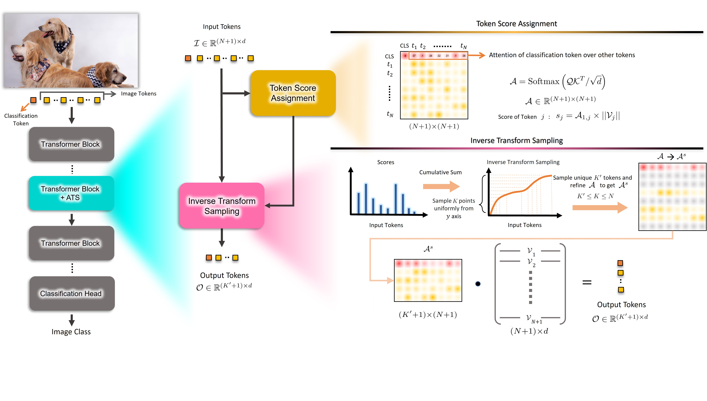

# Adaptive Token Sampling For Efficient Vision Transformers

This is the official implementation of the ECCV 2022 paper: ["Adaptive Token Sampling for Efficient Vision Transformers"](https://arxiv.org/pdf/2111.15667.pdf).

```BibTeX
@article{fayyaz2022ats,
  title={Adaptive token sampling for efficient vision transformers},
  author={Fayyaz, Mohsen and Abbasi Kouhpayegani, Soroush and Rezaei Jafari, Farnoush 
  and Sommerlade, Eric and Vaezi Joze, Hamid Reza and Pirsiavash, Hamed and Gall, Juergen},
  journal={European Conference on Computer Vision (ECCV)},
  year={2022}
}
```


<p align="justify">While state-of-the-art vision transformer models achieve promising results for image classification, they are computationally expensive and require many GFLOPs. Although the GFLOPs of a vision transformer can be decreased by reducing the number of tokens in the network, there is no setting that is optimal for all input images. In this work, we, therefore, introduce a differentiable parameter-free Adaptive Token Sampling (ATS) module, which can be plugged into any existing vision transformer architecture. ATS empowers vision transformers by scoring and adaptively sampling significant tokens. As a result, the number of tokens is not constant anymore and varies for each input image. By integrating ATS as an additional layer within current transformer blocks, we can convert them into much more efficient vision transformers with an adaptive number of tokens. Since ATS is a parameter-free module, it can be added to off-the-shelf pre-trained vision transformers as a plug-and-play module, thus reducing their GFLOPs without any additional training. Moreover, due to its differentiable design, one can also train a vision transformer equipped with ATS. We evaluate our module on both image and video classification tasks by adding it to multiple SOTA vision transformers. Our proposed module improves the SOTA by reducing the computational cost (GFLOPs) by 2x while preserving the accuracy of SOTA models on ImageNet, Kinetics-400, and Kinetics-600 datasets.</p>
</br>



## Installation

Please make sure your setup satisfies the following requirements:

## Requirements

Largely follows the original SlowFast repo requirements:
- Python >= 3.8
- timm == 0.4.12
- Numpy
- PyTorch >= 1.3
- [fvcore](https://github.com/facebookresearch/fvcore/): `pip install 'git+https://github.com/facebookresearch/fvcore'`
- [torchvision](https://github.com/pytorch/vision/) that matches the PyTorch installation.
  You can install them together at [pytorch.org](https://pytorch.org) to make sure of this.
- simplejson: `pip install simplejson`
- PyYaml: (will be installed along with fvcore)
- tqdm: (will be installed along with fvcore)
- torchvision: `pip install torchvision` or `conda install torchvision -c pytorch`
- tensorboard: `pip install tensorboard`

## Usage

**Data preparation**: download and extract ImageNet images from http://image-net.org/. The directory structure should be

```
│ILSVRC2012/
├──train/
│  ├── n01440764
│  │   ├── n01440764_10026.JPEG
│  │   ├── n01440764_10027.JPEG
│  │   ├── ......
│  ├── ......
├──val/
│  ├── n01440764
│  │   ├── ILSVRC2012_val_00000293.JPEG
│  │   ├── ILSVRC2012_val_00002138.JPEG
│  │   ├── ......
│  ├── ......
```

### Evaluation

Download the pretrained Deit-S model from [LINK.](https://dl.fbaipublicfiles.com/deit/deit_small_patch16_224-cd65a155.pth) 

```bash
python tools/run_net.py \
  --cfg configs/ImageNet/DeiT_S.yaml \
  DATA.PATH_TO_DATA_DIR path_to_your_dataset \
  TEST.CHECKPOINT_FILE_PATH path_to/deit_small_patch16_224-cd65a155.pth 
```

## Acknowledgements

This repo is built using components from [SGS](https://github.com/SimilarityGuidedSampling/Similarity-Guided-Sampling), [SlowFast](https://github.com/facebookresearch/SlowFast), [XViT](https://github.com/1adrianb/video-transformers), and [timm](https://github.com/rwightman/pytorch-image-models)

## License

ATS code is released under the [Apache 2.0 license](LICENSE).
